# TizuMark 渲染验证文档：全功能 + 边界条件

> 用途：逐项验证当前版本的渲染能力。**每一节的示例都各不相同**（无重复内容）。
> 带 `<!-- expect: ... -->` 标记的代码块是**故意**超出本地语法子集 / 故意写错的，用于验证降级与报错路径。

## 0. 怎么用这份文档

1. 用 TizuMark 打开本文件，对照每节末尾的「**预期**」逐条看；
2. 三个**可切换**的渲染开关，请分别开关各验证一次：
   - 设置 → 扩展语法高亮（`==文字==`）
   - 设置 → 公式按章节编号（2.1）
   - 设置 → 代码块行号 / 代码块滚动条
3. 文档末尾（§11）是一份勾选清单，可直接当验收单用。

[TOC]

---

## 1. 基础 Markdown 语法

### 1.1 标题层级与段落

这一节验证 h1–h6 的层级样式与锚点生成。h1 已被文档标题占用，下面从 h4 展示到 h6。

#### 四级标题：段落与换行

普通段落：Markdown 的软换行会把两行合并成一个段落
所以这一行在渲染后应与上一行**连在同一段**里。

行尾两个空格触发硬换行，下面这行会另起一行  
（这一行是硬换行的结果）。

##### 五级标题：中文与英文混排

Mixed CJK + English 123 与全角标点：这是「引号」、这是（括号）、这是【方括号】。

###### 六级标题：最小层级

> **预期**：五级标题字号阶梯下降、不溢出；六级标题仍可辨识，且工具栏大纲能列出全部标题。

### 1.2 强调与行内标记

| 写法 | 渲染结果 |
|---|---|
| `**x**` | **粗体** |
| `*x*` | *斜体* |
| `***x***` | ***粗斜体*** |
| `~~x~~` | ~~删除线~~ |
| `==x==` | ==高亮（需开启扩展语法）== |
| `` `x` `` | `行内代码` |

行内代码里的标记不应生效：`**不该变粗**`、`==不该高亮==`、`$不该变公式$`。

> **预期**：关闭「扩展语法高亮」后，上面的高亮退化为普通文本 `==高亮（需开启扩展语法）==`；行内代码内的符号一律按字面显示。

### 1.3 列表：无序、有序、嵌套、任务

- 一级：外壳
  - 二级：内衬
    - 三级：垫圈
      - 四级：螺栓（M6×20）
- 一级：轴承
  - 二级：滚珠（直径 8 mm）

1. 有序列表从 1 开始
2. 第二项
3. 第三项

3. 这一组从 3 开始（验证起始序号）
4. 紧随其后
5. 收尾

- 混合嵌套示例：
  1. 有序嵌在无序里
  2. 第二项
     - 无序又嵌回有序里
- 回到无序

- [ ] 未完成项：补充单位换算表
- [x] 已完成项：核对材料清单
- [ ] 带嵌套的未完成项
  - [x] 子项已完成：确认供应商
  - [ ] 子项未完成：等待报价

> **预期**：嵌套缩进逐级可见；`3.` 起始的有序列表序号从 3 开始；任务列表复选框可点击切换（预览里不再是 disabled）。

### 1.4 引用块

> 一层引用：冷却水温度应保持在 20–25 ℃。
>
> > 二层嵌套引用：若超过 30 ℃，换热效率下降约 12%。
> > 继续第二层的第二行。
>
> 回到第一层，接着放一个列表：
> - 检查水泵扬程
> - 检查管路结垢
>
> 再放一段代码：
> ```ini
> [cooling]
> target = 22
> tolerance = 3
> ```

> **预期**：引用块有左侧竖线与底色；嵌套引用层级可见；引用内的代码块仍带高亮。

### 1.5 分隔线、转义、HTML 实体

三种分隔线写法应长得一样：

---
***
___

转义：\*这不是斜体\*、\_这不是下划线\_、\[这不是链接\]、\`这不是代码\`。

HTML 实体：`&amp;` → &amp;、`&lt;` → &lt;、`&gt;` → &gt;、`&copy;` → &copy;、`&nbsp;` → 不换行&nbsp;空格、`&#8594;` → &#8594;。

> **预期**：三条分隔线外观一致；所有转义字符按字面显示；实体正确解码。

### 1.6 链接：内联、参考式、自动、锚点

- 内联链接：[TizuMark 官网](https://www.tizumark.app "官网标题")
- 参考式链接：[参考式示例][ref-manual]，以及紧凑写法 [ref-manual][]。
- 裸 URL 自动识别：https://www.tizumark.app/docs （应变成可点链接）
- 邮箱自动识别：support@tizumark.app （应变成 mailto 链接）
- 站内锚点：[跳到 §1.3 列表](#13-列表)
- 空锚点（验证不再弹红条）：[点我（空锚点）](#)
- 故意写错的锚点：[跳到不存在的章节](#不存在的锚点)

[ref-manual]: https://example.org/handbook "参考式链接目标"
[ref-manual]: https://example.org/handbook "参考式链接目标"

> **预期**：前 5 条可点且跳转正确；点「空锚点」**不出现红色错误条**（这是已修过的崩溃点）；点错锚点无反应、不报错。

### 1.7 图片

- 相对路径（文件不存在，用于验证失败占位）：
  
- 带 title：
- 远程图片（离线时会保留原 URL 并提示）：
  
- 内联 HTML 图片（带固定宽度）：
  

> **预期**：本地缺失图显示占位/替代文字而不是整块空白；远程图给出可读提示；HTML `` 的 width 生效。

### 1.8 脚注

正文里引用第一条脚注[^fn-thermal]，再引用第二条脚注[^fn-units]，最后重复引用一次第一条[^fn-thermal]。

[^fn-thermal]: 热阻计算公式见 `R = ΔT / P`，单位 K/W。
[^fn-units]: 单位换算：1 in = 25.4 mm，1 lbf = 4.448 N，参考 [NIST](https://www.nist.gov)。

> **预期**：脚注编号连续、可点击回跳；重复引用复用同一编号；脚注区内含行内代码与链接。

### 1.9 缩写（abbr）

*[DMAIC]: Define-Measure-Analyze-Improve-Control
*[SPC]: Statistical Process Control
*[OEE]: Overall Equipment Effectiveness

本节正文里出现 DMAIC、SPC 与 OEE 时，鼠标悬停应显示完整释义；代码块里的同名缩写不应被替换：

```text
OEE = 可用率 × 性能 × 良率
```

> **预期**：正文缩写出现虚线下划线 + 悬停提示；代码块内保持字面文本。

### 1.10 Emoji 短码

:fire: 高温工位、:snowflake: 低温工位、:rocket: 试产、:tada: 交付、:warning: 注意、:white_check_mark: 通过、:x: 失败、:bulb: 改善提案、:memo: 会议纪要、:coffee: 休息。

行内代码里的短码不应替换：`:fire:`，代码块同理：

```text
:rocket: :tada: 保持字面
```

> **预期**：正文短码变成对应图标；代码与行内代码里的短码保持字面。

### 1.11 表格

| 项目 | 规格 | 公差 | 结论 |
|:-----|:----:|-----:|:-----|
| 内径 | 25 mm | `±0.02` | 合格 |
| 外径 | 52 mm | ±0.03 | 合格 |
| **宽度** | 15 mm | ±0.05 | ==复检== |
| 硬度 | HRC 58–62 | [详见标准](https://example.org/std) | 合格 |

单元格里放公式与引用：压比 $p_2/p_1 = 3.4$，编号见 \eqref{eq:energy}（表格内引用）。

宽表示例（6 列 × 8 行，数据各不相同）：

| 序 | 温度 ℃ | 压力 kPa | 流量 kg/s | 功率 kW | 备注 |
|---:|---:|---:|---:|---:|:---|
| 1 | 18.5 | 101.3 | 0.42 | 12.5 | 启动前 |
| 2 | 21.0 | 102.7 | 0.45 | 13.1 | 暖机 |
| 3 | 24.8 | 105.2 | 0.51 | 14.6 | 稳态 |
| 4 | 26.3 | 106.9 | 0.55 | 15.2 | 稳态 |
| 5 | 28.7 | 108.4 | 0.58 | 15.8 | 负载 +10% |
| 6 | 31.2 | 110.1 | 0.61 | 16.4 | 负载 +20% |
| 7 | 22.4 | 103.5 | 0.47 | 13.7 | 降载 |
| 8 | 19.1 | 101.8 | 0.43 | 12.8 | 停机准备 |

> **预期**：列对齐生效（左/中/右）；单元格内加粗、高亮、行内代码、公式、链接都正常；表格横向不溢出容器；表格里的 `\eqref` 是可点链接。

### 1.12 代码块：语言、行号、长块

```javascript
// 唯一示例：滑动平均滤波
function movingAverage(samples, window) {
  if (!Array.isArray(samples) || window < 2) return samples;
  const out = [];
  let sum = 0;
  for (let i = 0; i < samples.length; i++) {
    sum += samples[i];
    if (i >= window) sum -= samples[i - window];
    out.push(i >= window - 1 ? +(sum / window).toFixed(3) : null);
  }
  return out;
}
```

```python
# 唯一示例：校验温度采样序列的单调区间
def monotonic_spans(readings):
    spans, start = [], 0
    for i in range(1, len(readings)):
        if readings[i] < readings[i - 1]:
            if i - start > 1:
                spans.append((start, i - 1))
            start = i
    return spans
```

```bash
# 唯一示例：批量重命名导出文件（干跑）
for f in ./export/*.docx; do
  base=$(basename "$f" .docx)
  echo "mv $f ./export/final_${base// /_}.docx"
done
```

```sql
-- 唯一示例：按班次汇总良率
SELECT shift, COUNT(*) AS total,
       SUM(CASE WHEN result = 'PASS' THEN 1 ELSE 0 END) * 1.0 / COUNT(*) AS yield
FROM inspection
WHERE inspected_at >= '2026-03-01'
GROUP BY shift
ORDER BY shift;
```

```json
{
  "station": "WS-07",
  "limits": { "tempMax": 42.5, "pressureMin": 98.0 },
  "alarms": ["T_HIGH", "P_LOW"],
  "enabled": true
}
```

```yaml
station: WS-08
limits:
  tempMax: 43.0
  pressureMin: 97.5
alarms:
  - T_HIGH
  - P_LOW
enabled: false
```

```diff
- 采样间隔 = 100 ms
+ 采样间隔 = 50 ms   # 提高分辨率，代价是噪声更明显
```

```text
无语法高亮的纯文本块：
  ├─ 第一层
  └─ 第二层
```

未知语言标记（应退化为普通代码块，不报错）：

```nosuchlang
this is not a known language tag
```

空代码块（应保持为一个空块，不塌陷成空白）：

```
```

> **预期**：各语言着色正确；行号开关生效；未知语言与空块都不报错。

---

## 2. 数学公式（KaTeX）

### 2.1 行内与块级

行内公式：质能关系 $E = mc^2$ 说明质量与能量等价；再试一个带单位的行内式 $v = 20\ \mathrm{m/s}$。

块级公式（无 `\label`，**不应**被自动编号）：

$$
\bar{x} = \frac{1}{n}\sum_{i=1}^{n} x_i
$$

> **预期**：行内公式与正文基线对齐、不撑行高；块级公式居中且不占编号。

### 2.2 常用结构

$$
\begin{aligned}
\text{分式}&& \frac{a+b}{c-d} \qquad
\text{根式}&& \sqrt[3]{x^{2}+y^{2}} \\
\text{求和}&& \sum_{k=1}^{\infty}\frac{1}{k^{2}} = \frac{\pi^{2}}{6} \qquad
\text{积分}&& \int_{0}^{\infty} e^{-t^{2}}\,dt = \frac{\sqrt{\pi}}{2} \\
\text{极限}&& \lim_{n\to\infty}\left(1+\frac{1}{n}\right)^{n} = e \qquad
\text{向量}&& \vec{F} = m\vec{a}
\end{aligned}
$$

矩阵与分段函数（两个独立块）：

$$
\mathbf{A} = \begin{pmatrix} \cos\theta & -\sin\theta \\ \sin\theta & \cos\theta \end{pmatrix},
\qquad
\mathbf{B} = \begin{bmatrix} 1 & 2 \\ 3 & 4 \end{bmatrix}
$$

$$
f(x) = \begin{cases}
x^{2}, & x \ge 0 \\
-x, & x < 0
\end{cases}
$$

> **预期**：对齐环境各列对齐；矩阵括号正确；分段函数右侧条件列对齐。

### 2.3 自动编号与交叉引用

下面三个带 `\label` 的块级公式应按**全文连续**编号（默认开关下为 (1)(2)(3)）：

$$
E = mc^{2} \label{eq:energy}
$$

$$
P(A\mid B) = \frac{P(B\mid A)\,P(A)}{P(B)} \label{eq:bayes}
$$

$$
x = \frac{-b \pm \sqrt{b^{2}-4ac}}{2a} \label{eq:quadratic}
$$

各类引用写法（同一段落里各自出现一次）：

- 标准引用：\eqref{eq:energy}
- 不带括号：\ref{eq:bayes}
- 多标签合并：\cref{eq:energy,eq:bayes}
- 连续三个 → 应压成区间：\cref{eq:energy,eq:bayes,eq:quadratic}
- 英文类型词：\Cref{eq:quadratic}
- 自动类型词（中文）：\autoref{eq:energy}
- **前向引用**（标签定义在 §6.1）：\eqref{eq:forward}

> **预期**：编号与显示值一一对应；多标签引用各自成链可分别点击；连续三个显示为 `(1–3)`；点引用跳到目标公式并高亮；前向引用也能解析（不受定义顺序影响）。

### 2.4 自定义 `\tag` 与其引用

$$
\text{校正系数} = 1.02 \tag{3′} \label{eq:custom}
$$

引用自定义编号：\eqref{eq:custom}，不带括号：\ref{eq:custom}。

> **预期**：显示 `(3′)` 而不是某个自动序号；该 `(3′)` 上可点击复制 `\eqref{eq:custom}`；引用显示 `(3′)`。

### 2.5 `\notag` 关闭编号

$$
\text{中间量} = \frac{p_1 V_1}{T_1} \notag \label{eq:internal}
$$

> **预期**：公式右侧**没有**编号；控制台出现一条诊断（`\notag` 使该 `\label` 失效）。

### 2.6 章节级编号（需开启设置）

$$
\eta_{\text{cycle}} = 1 - \frac{T_c}{T_h} \label{eq:carnot}
$$

> **预期**：关闭「公式按章节编号」时，本式延续全文流水号；开启后变为 `2.x`（本节所属章节号 + 节内序号），且每节重新计数。

### 2.7 siunitx 单位与数值

行内用法：$\SI{9.81}{m/s^2}$、$\qty{3.5}{\kilo\gram}$、$\si{\metre\per\second}$、$\unit{\celsius}$、$\num{1.23e4}$、$\ang{45}$、$\SIrange{20}{25}{\celsius}$、$\SIlist{1;2;3}{\metre}$、$\qtylist{0.5;1.5;2.5}{\kilo\watt}$。

`\sisetup` 在数学块内应被吞掉、不显示原文（它必须写在数学环境里）：

$$
\sisetup{per-mode=symbol}\quad \SI{2.5}{m/s}\quad\text{与}\quad \qty{1.2}{\kilo\watt}
$$

> **预期**：以上全部渲染为「数值 + 单位」正常排版；`\sisetup` 自己不出现任何可见文字。

### 2.8 mhchem 化学式

行内：$\ce{H2O}$、$\ce{2H2 + O2 -> 2H2O}$、$\ce{CO2 + H2O <=> H2CO3}$；浓度：$\pu{1.5 mol//L}$。

> **预期**：化学式正确排版（下标、箭头、可逆箭头）。

### 2.9 容错与边界

- **未定义引用**（应显示 `(?)` 且鼠标悬停有提示）：\eqref{eq:missing}
- **重复 label**：下面两个公式都写 `\label{eq:dup}`，应取首次出现并给出诊断；
- **行内公式里的 `\label`**（无意义，应被忽略并诊断）：$y\label{eq:inline} = kx + b$
- **未闭合的美元符号**：这里有一个孤立的 $ 只是价格符号，后面没有配对，因此**不应**把后续文字变成公式。
- **下划线不转义**：变量命名 file_name_with_underscores 不应变成斜体。
- **数学里的转义**：百分比 $12.5\%$、和号 $a \mathbin{\&} b$、井号 $\#3$、下划线 $x\_1$。
- **绝对值**：$\lVert x \rVert = \sqrt{x^{2}}$ 与 $\left| \frac{a}{b} \right|$。

重复 label 的两个公式：

$$
u_1 = \frac{1}{2} k x^{2} \label{eq:dup}
$$

$$
u_2 = m g h \label{eq:dup}
$$

> **预期**：若引用 `\eqref{eq:dup}` 应显示**首次**出现的编号；控制台输出一条「公式引用诊断」汇总；孤立 `$` 不引发大面积误渲染。

---

## 3. Mermaid

### 3.1 流程图（含子图与样式类）

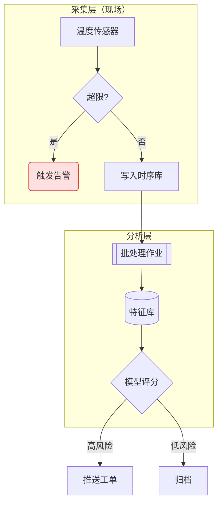

### 3.2 时序图（含 note / loop / alt）

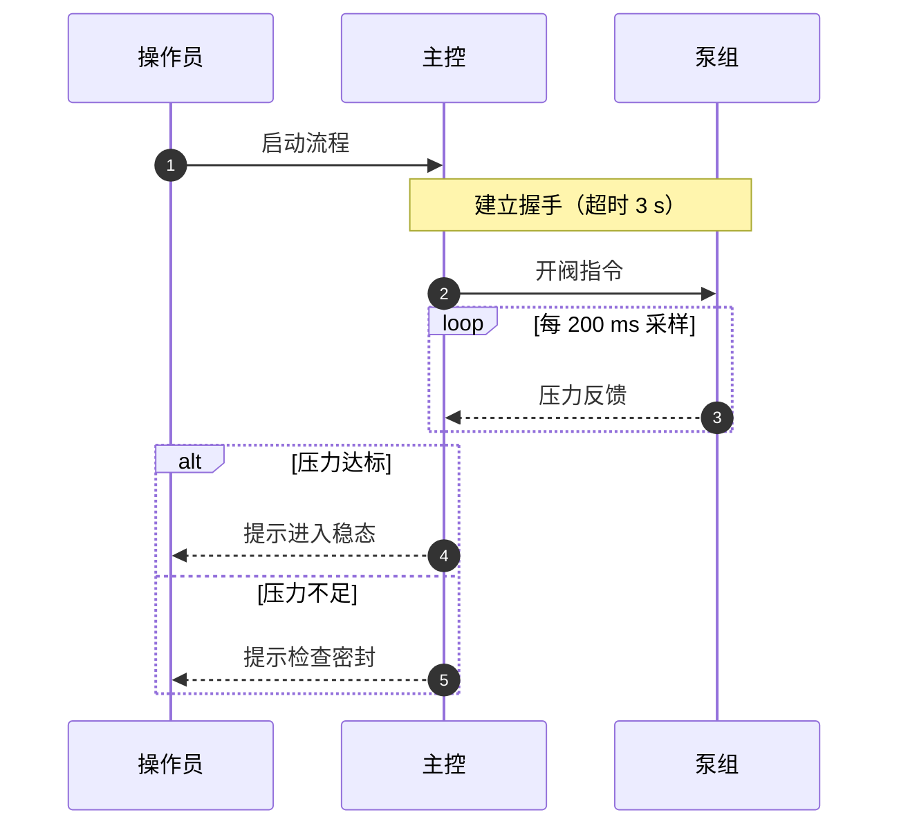

### 3.3 类图

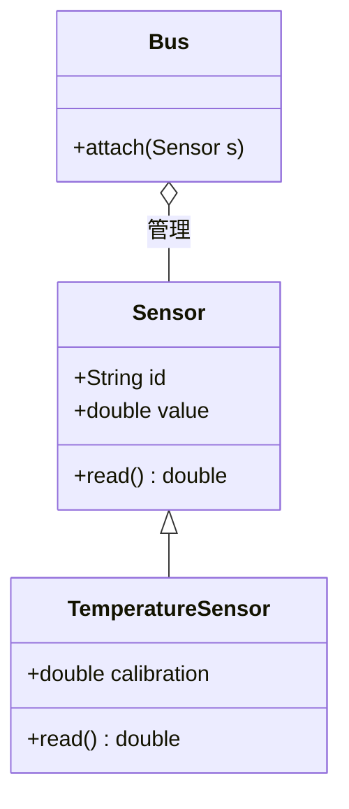

### 3.4 状态图

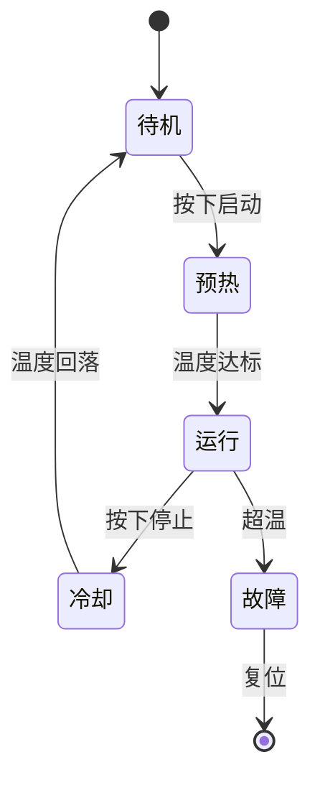

### 3.5 甘特图（Mermaid 原生语法）

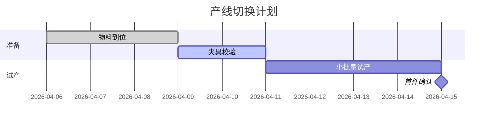

### 3.6 饼图

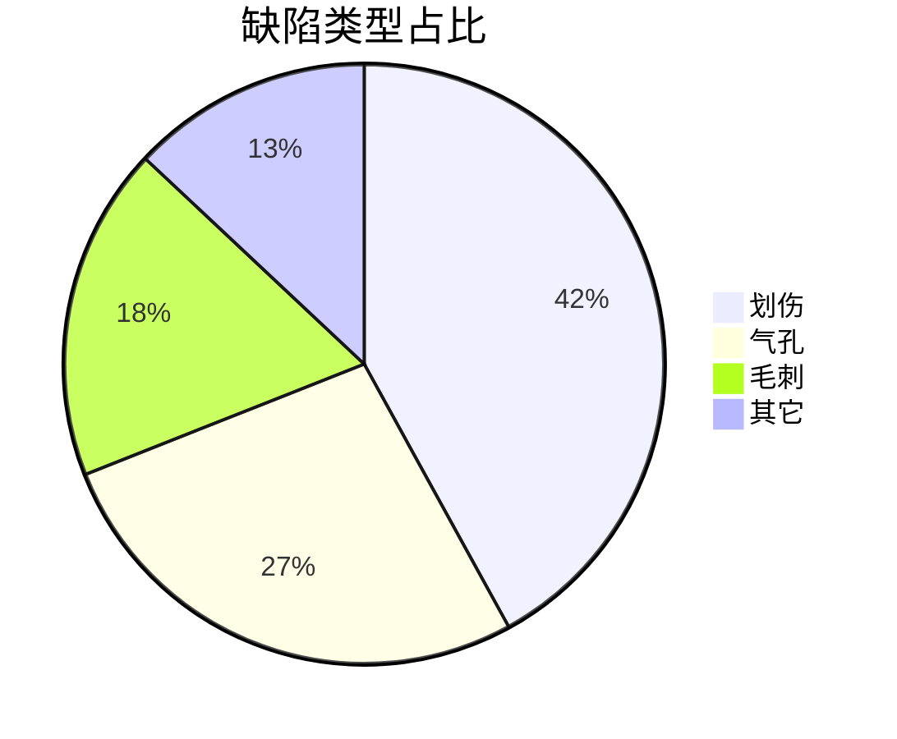

### 3.7 思维导图（Mermaid 原生语法）

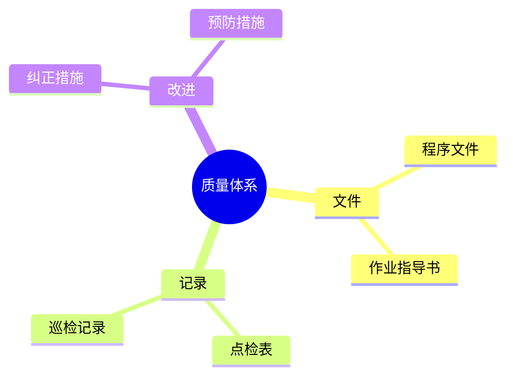

<!-- expect: error-box -->
### 3.8 故意写错的 Mermaid（验证报错可见 + 源码保留）

```mermaid
flowchart LR
  X[开始 --> Y{未闭合的方括号
```

<!-- expect: error-box -->
### 3.9 空的 Mermaid 块（验证空内容不崩溃）

```mermaid
```

> **预期**：3.1–3.7 正常渲染、跟随主题重绘、可点击放大；3.8/3.9 显示可读的失败原因并**保留原始源码**（不静默空白）。

---

## 4. PlantUML（本地转换为 Mermaid）

> **图种判定规则**（决定走哪个转换器，值得先知道）：
> `@startmindmap` / `@startwbs` → 思维导图，`@startgantt` → 甘特图，`@startjson|yaml|salt` → 不渲染；
> 其余按内容判定：出现 `[*]` 或 `state` → 状态图，`start/stop`、`:动作;`、`if(`／`while(` → 活动图，
> `class`／`<|--`／`*--` 等 → 类图，出现 `usecase`／`component` 关键字或行首 `[X]`／`(X)` 声明 →
> 组件/用例图，最后才是时序图（`participant|actor|database` 声明或 `A -> B` 单短横线）。
> 注意 `A --> B : 标签` 会被判为**时序图**；组件/用例图请带上 `[X]`／`(X)`／关键字声明。

### 4.1 类图（继承 / 实现 / 组合 / 依赖 / 可见性）

```plantuml
@startuml
abstract class 形状 {
  +面积(): double
  #名称: String
}
interface 可绘制 {
  +绘制(): void
}
class 点 {
  +x: double
  +y: double
}
class 圆 {
  -半径: double
}
形状 <|-- 圆
圆 ..|> 可绘制
圆 *-- 点
可绘制 ..> 点
@enduml
```

### 4.2 时序图（含 skinparam 噪声行，应被忽略）

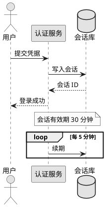

### 4.3 活动图（if / elseif / else / while）

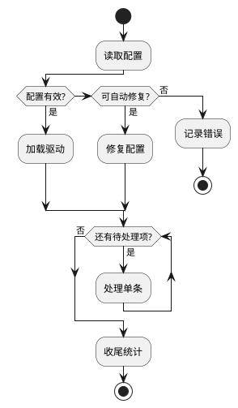

### 4.4 状态图

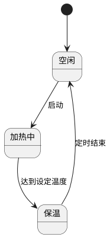

### 4.5 思维导图（层级 + 颜色标记）

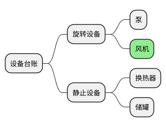

### 4.6 组件图 / 用例图

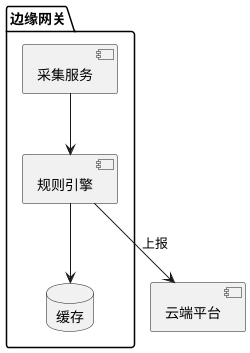

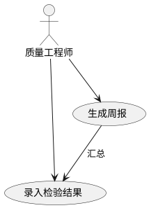

### 4.7 甘特图（本次新增的渲染能力）

```plantuml
@startgantt
title 版本发布排期
Project starts 2026-05-11
-- 设计阶段 --
[需求冻结] lasts 5 days
[接口设计] lasts 2 weeks
-- 开发阶段 --
[编码] starts at [接口设计]'s end
[编码] lasts 12 days
[联调] lasts 4 days
[编码] -> [联调]
-- 里程碑 --
[提测] happens at 2026-06-22
[需求冻结] is colored in lightblue
[编码] is done
@endgantt
```

英文日期与相对偏移（独立示例）：

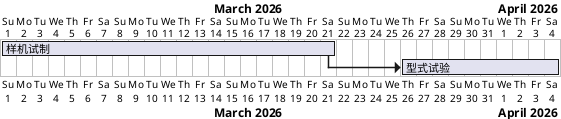

别名验证（`puml` / `uml` / `pu` 三种围栏应等价）：

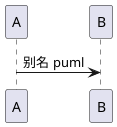

```uml
@startuml
B -> C: 别名 uml
@enduml
```

```pu
@startuml
C -> D: 别名 pu
@enduml
```

<!-- expect: fallback -->
### 4.8 甘特图边界一：没有起点、推不出来（应保留原代码块 + 提示）

```plantuml
@startgantt
[可行性研究] lasts 6 days
[立项评审] lasts 2 days
@endgantt
```

<!-- expect: fallback -->
### 4.9 甘特图边界二：子集外的任务语句（应保留原块，不猜）

```plantuml
@startgantt
Project starts 2026-07-01
[场地勘察] frobnicates 3 days
@endgantt
```

<!-- expect: fallback -->
### 4.10 非渲染视图：JSON / YAML / salt（应提示具体缺哪条语法）

```plantuml
@startjson
{ "line": "L3", "speed": 42 }
@endjson
```

<!-- expect: fallback -->
```plantuml
@startyaml
line: L4
speed: 38
@endyaml
```

<!-- expect: fallback -->
```plantuml
@startsalt
{+
  用户名 | "op-01"
  密码   | "******"
}
@endsalt
```

<!-- expect: fallback -->
### 4.11 活动图并发分支（fork，超出子集）

```plantuml
@startuml
start
fork
  :分支 A;
fork again
  :分支 B;
end fork
stop
@enduml
```

### 4.12 时序图 autonumber（透传给 Mermaid，可用）

```plantuml
@startuml
autonumber
participant 客户 as C
participant 客服 as S
C -> S: 咨询
S --> C: 答复
@enduml
```

> **预期**：4.1–4.7 渲染为对应图形（时序图里的 `skinparam` 行被忽略，不影响结果；甘特图按绝对日期排布、里程碑显示为菱形、`is done` 有完成标记）；4.8–4.12 保留原始代码块并在顶部显示提示条，提示里**指出具体缺哪条语法**（例如 `@startjson`、`活动图 fork/split 并发分支`）。

---

## 5. D2

### 5.1 基本方向与连线

```d2
direction: right
客户 -> 网关: HTTPS
网关 -> 服务: gRPC
服务 -> 数据库: SQL
缓存 <- 服务
网关 <-> 配置中心: 长连接
```

### 5.2 标签、形状与嵌套块

```d2
direction: down
边缘节点: {
  采集 -> 过滤
  过滤 -> 缓冲
}
云端: {
  入库 -> 训练
  训练 -> 发布
}
边缘节点.缓冲 -> 云端.入库: 批量上传
缓冲.shape: cylinder
发布.shape: diamond
```

### 5.3 无方向声明的最小图

```d2
单机模式 -> 集群模式
集群模式 -> 多活模式
```

### 5.4 边界：超出子集的 D2 写法（`style.*` 等被忽略）

```d2
style.fill: "#ffd27f"
节点样式 -> 目标
```

> **预期**：5.1–5.3 渲染为流程图（嵌套块变成子图、`shape` 生效）；5.4 的 `style.fill` 一行被**忽略**
> （不产生名叫 `style` 的幽灵节点，也不影响其余内容），整块仍渲染为「节点样式 → 目标」。

---

## 6. 自研 SVG 引擎：TikZ 与函数绘图

### 6.1 TikZ：折线、封闭路径、圆与矩形

前向引用的目标公式在这里定义：

$$
\text{雷诺数} \quad Re = \frac{\rho v D}{\mu} \label{eq:forward}
$$

```tikz
\draw[thick] (0,0) -- (3,0) -- (3,2) -- cycle;
\draw[red,dashed] (1,0.6) circle (0.5);
\draw[blue] (4,0) rectangle (6,1.4);
```

### 6.2 TikZ：填充、节点文字与线型

```tikz
\fill[green] (0,0) rectangle (1.2,0.8);
\filldraw[orange] (2.4,0.4) circle (0.4);
\node at (4,0.6) {出口};
\draw[ultra thick,dotted] (5.2,0) -- (7,1.2);
```

### 6.3 TikZ：比例、透明度与箭头

```tikz
\draw[->,thick,scale=1.5] (0,0) -- (2,0);
\draw[<->,opacity=0.5,purple] (0,1) -- (2,1);
```

### 6.4 TikZ：`\foreach` 展开

```tikz
\foreach \x in {0,1,2,3,4} \draw (\x,0) -- (\x,1);
\foreach \y in {0,0.5,1} \draw[gray] (0,\y) -- (4,\y);
```

### 6.5 TikZ：函数采样（plot）

```tikz
\draw[domain=0:3.14,samples=40] plot (\x, {sin(\x r)});
\draw[domain=0:2,samples=20,red] plot (\x, {0.5*\x*\x});
```

<!-- expect: fallback -->
### 6.6 TikZ 边界一：自定义样式与相对定位（超出子集）

```tikz
\begin{tikzpicture}[node distance=1.5cm, block/.style={draw, rounded corners}]
  \node[block] (a) {起点};
  \node[block, right of=a] (b) {终点};
  \draw[->] (a) -- (b);
\end{tikzpicture}
```

<!-- expect: fallback -->
### 6.7 TikZ 边界二：弧线与贝塞尔曲线（超出子集）

```tikz
\draw (0,0) arc (0:90:1.5);
\draw (2,0) .. controls (2.5,1) and (3.5,1) .. (4,0);
```

### 6.8 函数绘图：标题、坐标轴、网格与表达式

```plot
set title "阻尼振荡"
set xlabel "t / s"
set ylabel "位移"
set xrange [0:12]
set grid
plot exp(-0.25*x)*cos(3*x)
```

### 6.9 函数绘图：多曲线

```plot
set title "相位对比"
set xrange [-3.14:3.14]
plot sin(x)
plot cos(x)
```

### 6.10 函数绘图：采样点与参数

```plot
set samples 60
set yrange [-1.5:1.5]
plot tanh(x)
```

<!-- expect: fallback -->
### 6.11 函数绘图边界：非法表达式（应报错并保留源码）

```plot
set title "错误示例"
plot foo(bar)
```

> **预期**：6.1–6.5 生成矢量图（原点在左下、颜色/线宽/虚线/箭头可见、`\foreach` 展开为多条线、采样曲线平滑）；6.8–6.10 生成带坐标轴与刻度的图；6.6/6.7/6.11 显示可读失败原因 **并指出缺哪条语法**（`自定义样式（.style=…）`、`相对定位（node distance / right of…）`、`弧线 / 贝塞尔曲线 / to[…]`），同时保留源码。

---

## 7. 其它引擎（应用内置）

### 7.1 ECharts：折线（含自定义画布高度）

```echarts
{
  "tizuHeight": 320,
  "title": { "text": "月度产量（万件）" },
  "tooltip": { "trigger": "axis" },
  "grid": { "left": 48, "right": 24, "top": 56, "bottom": 36 },
  "xAxis": { "type": "category", "data": ["1月", "2月", "3月", "4月", "5月", "6月"] },
  "yAxis": { "type": "value" },
  "series": [
    { "name": "实际", "type": "line", "smooth": true, "data": [120, 132, 101, 134, 90, 160] },
    { "name": "计划", "type": "line", "lineStyle": { "type": "dashed" }, "data": [130, 130, 120, 130, 110, 150] }
  ]
}
```

### 7.2 ECharts：柱状 + 饼图联动数据

```echarts
{
  "tizuHeight": 280,
  "tooltip": {},
  "xAxis": { "type": "category", "data": ["A线", "B线", "C线", "D线"] },
  "yAxis": { "type": "value" },
  "series": [
    { "type": "bar", "data": [86, 92, 78, 95], "itemStyle": { "borderRadius": [4, 4, 0, 0] } }
  ]
}
```

<!-- expect: error-box -->
### 7.3 ECharts 边界：JSON 语法错误（应报错并保留源码）

```echarts
{ "title": { "text": "缺少右括号" }, "series": [ { "type": "bar", "data": [1, 2, 3] } ]
```

### 7.4 WaveDrom：波形图

```wavedrom
{ "signal": [
  { "name": "clk", "wave": "p......" },
  { "name": "req", "wave": "01.0..1" },
  { "name": "ack", "wave": "0..1.0." },
  { "name": "dat", "wave": "x.3.4.x", "data": ["A0", "B1"] }
] }
```

### 7.5 WaveDrom：寄存器视图（`reg` 块）

```wavedrom
{ "reg": { "bits": 4, "lanes": 2, "count": 3 } }
```

<!-- expect: error-box -->
### 7.5b WaveDrom 边界：`assign` 写成裸字符串数组（应给出可读提示）

```wavedrom
{ "reg": { "bits": 4, "lanes": 2 }, "assign": [ "写指针", "读指针" ] }
```

> **预期**：显示**中文可操作提示**「WaveDrom 的 assign 每一项需要数组结构（如
> `[["写指针", "表达式"]]`），不能写裸字符串："写指针"」并保留原始源码 ——
> 而不是引擎原文 `Cannot assign to read only property '1' of string …`。

### 7.6 Graphviz DOT：有向图（默认 dot 布局）

> 注意：DOT 语言规定**中文/含空格的名字必须加引号**，`来料 --> 检验` 是非法 DOT
> （会报 `syntax error ... near '--'`），正确写法是 `"来料" --> "检验"`。

```dot
digraph Process {
  rankdir=LR;
  node [shape=box, style=rounded, fontsize=11];
  edge [arrowhead=vee];
  "来料" --> "检验";
  "检验" --> "合格品" [label="合格"];
  "检验" --> "返工" [label="不合格"];
  "返工" --> "检验";
  "合格品" --> "入库";
}
```

### 7.6b Graphviz：中文节点名不加引号 —— 引擎会自动补引号

```dot
digraph Bad {
  来料 --> 检验;
}
```

> **预期**：与 7.6 一样正常渲染。DOT 词法只允许 ASCII 裸 ID，`来料 --> 检验` 原本会让 Graphviz
> 报 `syntax error ... near '--'`；而这是中文文档里最自然的写法，所以引擎在交给 Graphviz 前
> **自动为中文名补引号**。若这里显示 DOT 报错，说明自动补引号没生效 —— 请反馈。

### 7.7 Graphviz DOT：切换布局引擎（首行指令）

```dot
// engine: neato
graph Mesh {
  node [shape=circle, fixedsize=true, width=0.5];
  A -- B; B -- C; C -- D; D -- A; A -- C;
}
```

### 7.8 Markmap：交互式思维导图（一）

```markmap
# 现场改善
## 5S
### 整理
### 整顿
### 清扫
## 目视化
### 区域标识
### 看板管理
```

### 7.9 Markmap：交互式思维导图（二）

```markmap
# 培训体系
## 新员工
### 安全教育
### 工艺基础
## 在岗提升
### 技能矩阵
### 师带徒
```

### 7.10 五线谱（abcjs）——已移除，应显示为**普通代码块**

```abc
X:1
T:Staff notation was removed
K:C
C D E F G A B c
```

> **预期**：7.1/7.2 可交互（悬停 tooltip）；7.4/7.5 画出波形与寄存器；7.6/7.7 自动布局（7.7 用 neato 呈环形）；7.8/7.9 可折叠缩放；7.10 **不渲染五线谱**，只是一个普通代码块（带高亮/行号/复制按钮）。

---

## 8. Admonition（`!!!` / `???` / `:::`）

### 8.1 十三种类型（每种一条，内容各不相同）

!!! note "记录说明"
    设备点检记录需保留 12 个月，电子档与纸质档同时归档。

!!! abstract "摘要"
    本文给出换热网络节能改造的可行性与预期收益测算。

!!! info "环境影响"
    改造后年减少蒸汽消耗约 320 吨，对应减排 CO₂ 约 78 吨。

!!! tip "经验做法"
    先小流量冲洗 10 分钟再加负荷，可显著减少管路杂质进入换热器。

!!! important "关键参数"
    入口压力不得低于 0.35 MPa，否则联锁动作会触发停机。

!!! success "验证通过"
    连续 72 小时试运行无报警，各项指标均在设计区间内。

!!! question "常见疑问"
    为什么夜间需要降低循环泵转速？——夜间环境温度低，热负荷下降约 40%。

!!! warning "注意"
    严禁在带压状态下拆卸法兰螺栓，必须先泄压并确认压力表归零。

!!! failure "典型失效"
    密封圈老化导致的渗漏占总故障的 31%，建议纳入年度强制更换清单。

!!! danger "危险作业"
    进入受限空间前必须完成气体检测、通风与监护人到位三项确认。

!!! bug "已知缺陷"
    报表导出在跨年区间会出现月份错位，计划在下个版本修复。

!!! example "示例：能耗基线计算"
    基线 = 近 12 个月单位产品蒸汽消耗的中位数 × 年度产量。

!!! quote "标准引用"
    “用能单位应建立能源计量器具台账，并定期校准。”——《用能单位能源计量器具配备和管理通则》

### 8.2 自定义标题

!!! tip "带引号的自定义标题（含标点：A/B 与 ℃）"
    标题里出现引号、斜杠、单位符号时不应破坏结构。

### 8.3 别名（应映射到对应类型样式）

!!! hint "别名 hint → tip"
    别名应与目标类型同色同图标。

!!! caution "别名 caution → warning"
    此处应呈现警告（黄色）样式。

!!! attention "别名 attention → warning"
    同样是警告样式。

!!! error "别名 error → danger"
    此处应呈现危险（红色）样式。

### 8.4 折叠：`???`（默认收起）与 `???+`（默认展开）

??? note "点我展开：停机检查清单"
    1. 断开主电源并挂牌上锁
    2. 释放残余压力
    3. 记录停机时刻与原因代码
    4. 检查润滑脂状态

???+ tip "默认展开的折叠块"
    这条内容一开始就可见；点击标题可收起。

??? example "折叠块内嵌代码与公式"
    ```ini
    [alarm]
    high = 95
    low = 5
    ```
    触发阈值公式：$T_{alarm} = \bar{T} + 3\sigma$

### 8.5 嵌套 Admonition

!!! warning "外层：改造期间的临时措施"
    临时旁通管路必须每日巡检两次。

    !!! tip "内层：巡检要点"
        重点看法兰渗漏与支吊架位移，发现异常立即上报。

    内层结束后继续外层内容：巡检记录当班交接。

### 8.6 `:::` 容器语法（含同级嵌套与 `details`）

::: note
这是 `:::` 容器语法的普通提示块，内容与 `!!!` 等价。

::: tip "内层：不缩进的同级嵌套"
不缩进的嵌套也能正确配对（不会把内层闭合当成外层闭合）。
:::

外层结尾段落。
:::

::: details
`::: details` 应渲染为**默认收起**的折叠块。
:::

::: important "容器语法的自定义标题"
标题支持与 `!!!` 相同的写法。
:::

### 8.7 未知类型（应原样保留，不被吃掉）

!!! nosuchtype "未知类型示例"
    未知类型必须原样保留为文本，避免吃掉其它语法的写法。

### 8.8 折叠块内的图表（验证导出 PDF/Word 时会被展开）

??? warning "折叠的图表块（导出时应展开，内容不丢）"

    ```mermaid
    flowchart LR
      In[输入] --> Proc[处理] --> Out[输出]
    ```

    ```plot
    set title "折叠块内的曲线"
    set xrange [0:6]
    plot 2*x - 0.3*x*x
    ```

> **预期**：8.1 十三种类型配色/图标各不相同；8.2 自定义标题生效；8.3 别名映射正确；8.4 `???` 默认收起、`???+` 默认展开，块内代码/公式正常；8.5/8.6 嵌套层级清晰；8.7 未知类型原样显示 `!!! nosuchtype ...`；8.8 **预览里保持折叠**，导出 PDF / PNG / Word 时自动展开（否则内容会丢）。

---

## 9. 边界与压力用例

### 9.1 超长单行（不应出现横向溢出页面）

在缺乏外部基准数据且设备处于多品种小批量混线生产的条件下，质量部门需要在不增加在制品库存的前提下识别出影响一次交检合格率的关键工序组合，并据此调整点检频次与抽检比例，使得在三个月窗口内将一次交检合格率从百分之九十二提升到百分之九十六以上，同时把因返工导致的额外工时控制在每月一百二十小时以内，这一目标要求工艺、设备、质量三方在同一套指标口径下协同，并对偏差做出每日复盘与每周纠偏，任何单点指标的改善都不得以牺牲另外两项指标为代价，因此需要在数据采集粒度、判定规则与责任划分上做出一致约定并固化到作业指导书中。

### 9.2 超长 URL（应自动换行或横向滚动，不撑破容器）

https://www.tizumark.app/docs/render-verification/very/long/path/segment-01/segment-02/segment-03/segment-04/segment-05?query=alpha%3D1%26beta%3D2%26gamma%3D3%26delta%3D4%26epsilon%3D5%26zeta%3D6&fragment=section-9-2

### 9.3 深嵌套列表（8 层）

- L1 顶层
  - L2
    - L3
      - L4
        - L5
          - L6
            - L7
              - L8 最深层

### 9.4 含空单元格与单列的表

| 检查项 | 结论 | 备注 |
|---|---|---|
| 阀门填料 | 合格 | |
| | 待检 | 缺检验员签字 |
| 压力表 | | 已送检 |
| 安全阀 | 合格 | |

| 单列表头 |
|---|
| 唯一数据 A |
| 唯一数据 B |

### 9.5 相邻的多个代码块与连续分隔线

```ini
[first]
value = 11
```

```ini
[second]
value = 22
```

```ini
[third]
value = 33
```

***

---

### 9.6 HTML 注释与转义（注释不应出现在预览里）

<!-- 这段是 HTML 注释，预览里不应显示；也不应破坏后续内容 -->

行内 HTML 应被转义为文本而不是执行：`<script>alert('xss')</script>` 与 <b>这行 b 标签应可见</b>。

### 9.7 特殊字符：零宽、组合音标、CJK、Emoji、全角

- 零宽字符夹在词中（肉眼应看不出多出字符）：甲​乙​丙
- 组合附加符号（越南语示例）：Tiếng Việt — Ệ 与 Ễ
- Emoji 序列（ZWJ 家庭）：👨‍👩‍👧‍👦 与旗帜 🏳️‍🌈
- 全角标点：，。；：？！（）【】《》——……·
- 特殊空白：用不换行空格连接 &nbsp;两&nbsp;词&nbsp;

### 9.8 同一屏内的四个不同引擎（验证占位不闪、互不干扰）

```mermaid
flowchart LR
  S[开始] --> E[结束]
```

```plot
set title "小图一"
plot sin(x)
```

```tikz
\draw (0,0) -- (1,1) -- (2,0);
```

```wavedrom
{ "signal": [ { "name": "a", "wave": "0101" } ] }
```

> **预期**：四个图各自独立渲染；渲染期间只显示「图表渲染中…」占位，**不出现源码闪现**，也不出现「一会儿代码一会儿图」；任一图出错不影响其余三个。

---

## 10. 长代码块与超宽代码行

### 10.1 60 行代码块（验证按需滚动条与行号对齐）

```python
1:  初始化采集通道
2:  打开串口
3:  设置波特率
4:  校验握手
5:  读取设备型号
6:  读取固件版本
7:  写入采样周期
8:  等待就绪标志
9:  启动定时器
10: 进入采样循环
11: 读取原始值
12: 单位换算
13: 均值滤波
14: 越限判断
15: 记录越限
16: 写入缓冲区
17: 判断缓冲区是否半满
18: 半满则落盘
19: 更新统计计数
20: 检查是否到达停止条件
21: 未到达则继续
22: 到达则退出循环
23: 停止定时器
24: 关闭串口
25: 汇总采样点数
26: 汇总越限次数
27: 计算均值
28: 计算标准差
29: 计算极差
30: 生成日报表
31: 写入日报文件
32: 生成周报表
33: 写入周报文件
34: 计算设备利用率
35: 计算平均无故障时间
36: 计算平均修复时间
37: 记录维护建议
38: 上传至平台
39: 校验上传结果
40: 失败则重试三次
41: 重试仍失败则告警
42: 告警写入本地队列
43: 等待下一轮
44: 释放缓冲区
45: 清理临时文件
46: 归档原始数据
47: 更新索引
48: 备份配置
49: 记录运行日志
50: 记录异常日志
51: 记录性能日志
52: 关闭日志句柄
53: 释放定时器
54: 释放采集通道
55: 复位状态机
56: 写入结束标记
57: 通知上层完成
58: 等待上层确认
59: 释放全部资源
60: 结束
```

### 10.2 超宽代码行（验证横向滚动）

```javascript
const matrix = [[1, 2, 3, 4, 5, 6, 7, 8, 9, 10], [11, 12, 13, 14, 15, 16, 17, 18, 19, 20], [21, 22, 23, 24, 25, 26, 27, 28, 29, 30], [31, 32, 33, 34, 35, 36, 37, 38, 39, 40], [41, 42, 43, 44, 45, 46, 47, 48, 49, 50], [51, 52, 53, 54, 55, 56, 57, 58, 59, 60], [61, 62, 63, 64, 65, 66, 67, 68, 69, 70], [71, 72, 73, 74, 75, 76, 77, 78, 79, 80]];
```

> **预期**：10.1 代码块出现纵向滚动条（若设置里开了「代码块滚动条」），行号与代码行严格对齐、滚动时不脱节；10.2 出现横向滚动，行号列不随内容横向漂移。

---

## 11. 验证清单（可直接当验收单）

### 11.1 图表与代码块

- [ ] 三张 Mermaid 原生图（3.1–3.7）全部渲染且可点击放大
- [ ] Mermaid 故意写错的块（3.8/3.9）显示失败原因 + 保留源码
- [ ] PlantUML 六类图（4.1–4.6）全部渲染
- [ ] PlantUML 甘特图（4.7）按日期排布、里程碑/依赖/done 正确
- [ ] `puml` / `uml` / `pu` 三个别名（4.7 末）行为一致
- [ ] 4.8–4.12 保留原块且提示条**指出具体语法**（如 `@startjson`、`fork/split`）
- [ ] D2（5.1–5.3）渲染、5.4 降级保留
- [ ] TikZ（6.1–6.5）渲染、6.6/6.7 报错并提示缺哪条语法
- [ ] plot（6.8–6.10）渲染、6.11 报错保留源码
- [ ] ECharts（7.1/7.2）可交互、7.3 报错可见
- [ ] WaveDrom（7.4/7.5）、DOT（7.6/7.7）、Markmap（7.8/7.9）正常
- [ ] `abc` 代码块（7.10）**只是普通代码块**

### 11.2 数学

- [ ] 行内/块级公式渲染，编号为 (1)(2)(3)…
- [ ] `\eqref` / `\ref` / `\cref` / `\Cref` / `\autoref` 全部可点且跳转正确
- [ ] `\cref{eq:energy,eq:bayes,eq:quadratic}` 显示为 `(1–3)`
- [ ] 自定义 `\tag{3′}` 显示正确，且其引用显示 `(3′)`
- [ ] 前向引用（§2.3 指向 §6.1）可解析
- [ ] 未定义引用显示 `(?)`；控制台出现诊断汇总
- [ ] 重复 label、行内 label、`\notag` 均产生诊断
- [ ] siunitx 全部命令排版正确（`\sisetup` 自己不显示）
- [ ] mhchem 化学式正确
- [ ] 表格单元格里的 `\eqref`（§1.11）可点

### 11.3 版式与交互

- [ ] 表格、引用、列表、分隔线、转义、实体全部正确
- [ ] 脚注编号连续、可回跳；缩写悬停有提示；Emoji 短码在正文生效、在代码内不生效
- [ ] 目录（`[TOC]`）可点且锚点正确
- [ ] 锚点链接（§1.6）跳转正确；**点空锚点不弹红色错误条**
- [ ] 图片缺失/远程图有可读提示，不整块空白
- [ ] Admonition 13 种类型、别名、嵌套、`:::` 容器、`details` 均正确
- [ ] 未知 `!!!` 类型原样保留
- [ ] 折叠块内的图表在**导出 PDF / Word / PNG 时展开**（内容不丢）
- [ ] §9.8 四个引擎同屏：无源码闪现、无「一会儿代码一会儿图」
- [ ] §10 长代码块的行号与滚动行为正确

### 11.4 大文档与导出

- [ ] 滚动本文件时，已渲染的图**不退回**「图表渲染中…」
- [ ] 导出 HTML / PDF / Word：内容完整（不只有当前视口那一段）
- [ ] Word 导出：公式带编号 `(1)`，且公式可双击编辑
- [ ] PDF 导出：正文里的 `(1)` 可点击跳转到公式（若阅读器不支持内链，属打印引擎限制）

---

<!-- 文档结束：本文件所有示例均不重复，按节分组，可直接用于逐项验收。 -->

